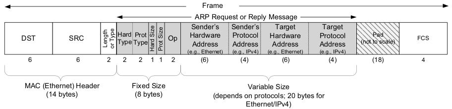
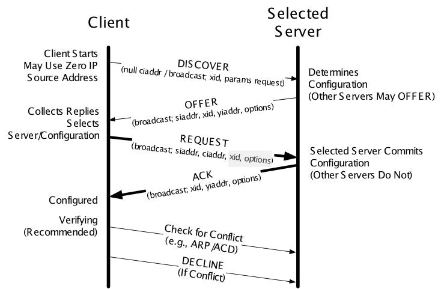

# ARP
* ARP sends an Ethernet frame called an _ARP request_ to every host on the network. 
This is called a _broadcast_. It contains the IP of the dest host
* Dest host receives the ARP requests and sends an _ARP reply_

----------------------
# DHCP
* DHCP comprises two major parts:
    * address management - dynamic allocation of IP addresses and provides address leases to clients
    * delivery of configuration data - includes the DHCP protocol’s message formats and state 
    machines.
* A DHCP server has 3 levels of address allocation (based on client identity):
    * Automatic
    * Dynamic
    * Manual
* Operation:
    * Messages from C to S are sent as UDP/IP datagrams containing a BOOTP BOOTREQUEST 
    operation and an appropriate DHCP message type (usually DHCPDISCOVER or DHCPREQUEST)
    * Such messages are sent from `0.0.0.0:68` to `255.255.255.255:67`
    * Messages from S to C are sent from the `S.S.S.S:67` to `255.255.255.255:68`

    * C - DHCPDISCOVER
    * Each S sends a DHCPOFFER (IP, mask, other options, lease timer, etc)
    * If C receives multiple offers, it picks the prefered option and broadcasts a DHCPREQUEST with 
    the chosen S's _Server Identifier_ and the _Requested IP Address_ options set
    * S replies with DHCPACK if allocation successful or DHCPNAK otherwise
    * C checks if the IP is used with ARP and if already in used sends a DHCPDECLINE to the server
    * After 10s (usually) the C can retry
    * If C chooses to give up the IP before the lease expires it sends a DHCPRELEASE
----------------------
# First Hop Redundancy
#### HSRP/VRRP
* Introduction:
    * Allows multiple routers to share a virtual IP and MAC address
* HSRP Features:
    * Virtual IP address and virtual MAC are active on the HSRP Active router
    * Standby routers listen for Hellos from the Active router, defaulting to a 3-sec
    hello interval and 10-sec dead interval
    * Highest priority is Active - no preemption by default
    * Supports object tracking
    * Up to 255 HSRP groups per interface
    * Virtual MAC of `0000.0C07.ACxx`, where `xx` is the hex HSRP group
    * Supports clear-text and MD5 authentication (through a key chain)
* VRRP Features:
    * uses a **multicast** virtual MAC address - `0000.5E00.01xx` - `xx` is the hex VRRP group 
    number
    * uses the IOS object tracking feature, rather than its own internal tracking mechanism, to 
    track interface states for failover purposes
    * Preempts by default
    * VRRP Master = HSRP Active
#### GLBP
* Features:
    * Adds load-sharing features
    * Host still point to a default GW IP Address
    * Up to 4 routers in a GLBP group
    * GLBP Active Virtual Gateway (AVG) assigns each router to a unique MAC address
    * MAC format - `0007.B400.xxyy` (`xx` - GLBP group number; `yy` - a different number for each 
    router)
    * When client ARPs come in for the virtual IP, the AVG replies with a different MAC address 
    (round-robin fashion)
----------------------   
# SNMP