# VLANs
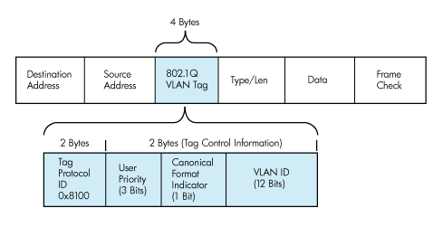
# STP
### STP Protocol Messages
* BPDUs - Bridge Protocol Data Units \
") 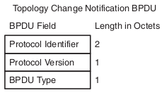
* Any 2 BPDUs are compared in the following sequence - first occurence of a lower values stops the 
process:
    * Root Bridge ID (RBID)
    * Root Path Cost (RPC)
    * Sender Bridge ID (SBID)
    * Sender Port ID (SPID)
    * Receiver Port ID (RPID; not included in the BPDU, evaluated locally)
### STP Timers
* Hello - 2s
* Forward Delay - 15s
* Max Age - 20s

### How it works
1. Elect root bridge
2. Elect root ports
3. Elect designated ports

#### Root bridge election
* Lowest bridge ID becomes root bridge
* Bridge contains
    * Bridge priority: 0 - 61440 (increments of 4096) - default 32768
    * System ID Extension: 0 - 4095 (for VLANs)
    * MAC Address (in a default switch group the lowest MAC becomes root)
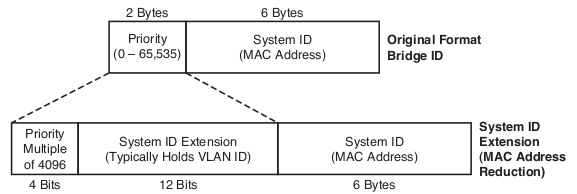
* Changing root election:
    * Manually - changing brigde priority (Lower is better)
    * Use root bridge macro (looks at current root bridge and sets the BID priority to lower than 
    that)
    
#### Root port election - Upstream forwarding
* Root creates and sends Hello BPDUs every 2 secs (default)
    * RBID and SBID set to it's own BID
    * RPC set to 0
    * SPID set to the egress port ID
* Every nonroot switch receives the BPDUs on a port and adds the cost of that ingress port to the 
RPC resulting **a new BPDU**. That ingress port becomes a Root Port.
* The **new BDPU** is forwarded out the Designated Ports (after updating the RPC, SBPID and SPID).
Hellos received on other non-root ports are processed but not forwarded
* Switches don't forward Hellos out Root/Blocking ports

#### Designated port election - downstream forwarding
* A converged STP topology results in only one switch forwarding Hellos onto each LAN segment. 
The switch that forwards Hellos onto a LAN segment is called the **designated switch** for that 
segment.
* The port connecting to the designaged switch is called a **designated port (DP)**
* All non-RP or non-DP ports will be Blocking Ports (BP)
* **RPs and BPs don't send BPDUs - only DPs send BPDUs out to a LAN Segment**
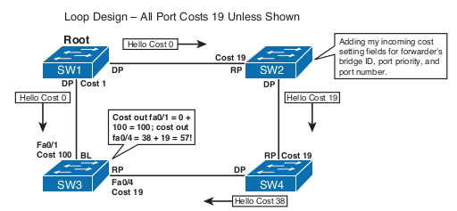

### Topology Changes
A topology change is an event that occurs when:
* A TCN BPDU is received by a DP of a switch
* A port moves to the Forwarding State and the switch has at least one DP
* A port moves from Learning or Forwarding to Blocking
* A switch becomes the root switch \
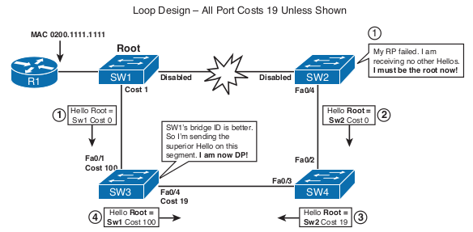

#### Reaction to a topology change
1. SW2's RP goes down so SW2 now thinks he is the Root bridge and start sending his BPDUs to SW4
2. SW4 sees SW2's BPDUs as inferior to the one he knows (SW1's) and will ignore them until SW1's 
BPDUs expire (MaxAge-MessageAge, or 20−1=19 seconds). During this time no BPDUs are sent to SW3
3. SW3 doesn't receive any BPDUs on Fa0/4 and after MaxAge-MessageAge, or 20−2=18 seconds. After 
that it becomes DP and moves into Listening state. Fa0/1 becomes the new RP and BPDUs will be 
forwarded out of Fa0/4 (with the necessary fields)
4. SW4 learns of a better RBID and moves Fa0/3 to RP and will inform SW2 about it
5. SW2 will do the same

#### Topology Change Notification and Updating the CAM
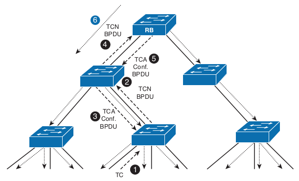
1. A TC event occurs on a port of a switch
2. The SW sends a TCN BPDU out its RP every Hello timer until Ack
3. The designated SW on that segment Ack that BPDU by sending a Hello with the TC Ack bit set
4. The same SW sends the TCN BPDU upstream and the process repeats
5. The Root bridge receives the TCN BPDU and sends a TC Ack
6. For the MaxAge+ForwardDelay seconds the Root will send BPDUs with the TC bit set telling SWs to
shorten their aging time for their MAC address tables to ForwardDelay secs

#### Port states
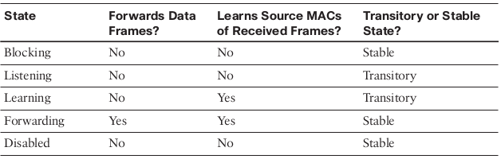

## RSTP
#### Port states
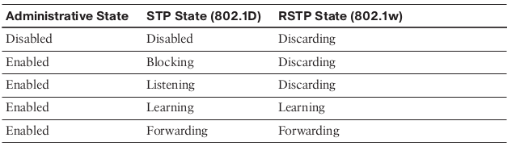
* A Discarding port continues to process received BPDUs; send BPDUs (depending on its role); 
and send and receive frames of inter-switch signaling protocols such as DTP, VTP, CDP, LLDP, 
PAgP, LACP, or LOOP.

#### Port roles
* Root Port - no changes
* Designated Port - no changes
* Alternate Port 
    * A backup for an RP
    * They receive BPDUs but don't meet the requirements to be a RP/DP
    * When the RP goes down the AP receiving the best BPDU is RAPIDLY moved to that role
* Backup Port 
    * A backup for a DP
    * They receive BPDUs but don't meet the requirements to be a DP
    * When the DP fails the BP takeover is NOT RAPID (timer driven)

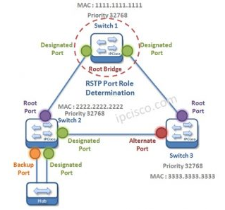

#### Port types
* Edge or Non-Edge
* An Edge Port 
    * Becomes DP immediately
    * Sends BPDUs but doesn't expect to receive any
    * If it receives a BPDU it moves to a Non-Edge type port
    * The config doesn't change and it will go back to Edge when bounced

#### Changes to BPDU Format and Handling
In RSTP there's only one type of BPDU used. The TCN BPDU is no longer used.

* In STP only the Root sends Config BPDUs. Non-root SWs relay Root BPDUs. Reaction is delayed in
case of a failure - if a non-root SW stops receiving BPDUs it has to wait MaxAge-MessageAge seconds 
for the BPDU stored on the Root Port to expire
* in RSTP every SW sends its own BPDUs (based on the Root BPDUs) allowing SWs to age-out BPDUs faster
(3 x Hello interval). The MessageAge field no longer matters in BPDU expiry. Only as a hop count metric.
Any BPDU whose MessageAge is equal to or higher than its MaxAge will be discarded upon arrival.

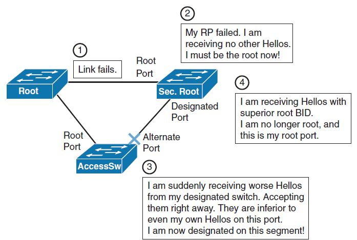

* Recovery from a _lost connectivity_ to the root bridge:
    * In STP if a SW receives an inferior BPDU it ignores it until its superior BPDU is aged out.
    * In RSTP an inferior BPDU is accepted straight away and STP re-evaluates its ports

#### Proposal/Agreement Process in RSTP
* _New link_ issues:

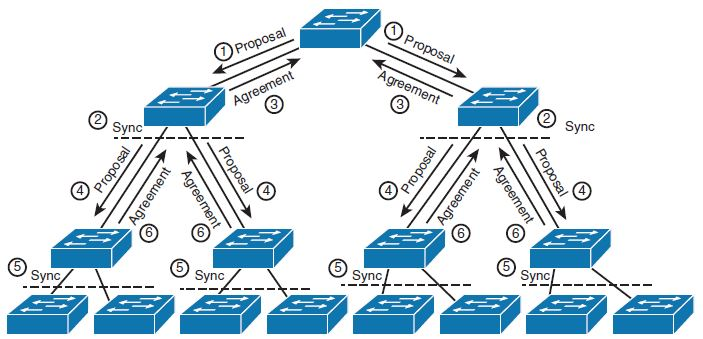

When a SW receives a BPDU on its RP with the Proposal bit set, it moves all its Non-Edge DPs to 
Discarding state (the proceess is called Sync) and also the RP. After the agreement with the 
upstream SW is over they both move their DPs and RPs to Forwarding and the process repeats on the 
next layer.

#### Topology Change Handling in RSTP
* In RSTP a TC is defined when:
    * a Non-Edge Non-Forwarding port moves to Forwarding
    * a BPDU with the TC flag set is received on a DP or RP
* A SW that receives such a BPDU on its RP/DP port will do the following:
    * Setup a tcWhile timer = Hello time plus one second on all DPs or RPs the one where the BPDU 
    came from
    * Flush the MAC addresses of all of these ports
    * Flood BPDUs with the TC bit set on all of these ports

## Multiple Spanning Trees - MST
#### Operation
* MST organizes the NW into multipe _regions_
* A region is a group of MST SWs that operate in the same way:
    * same number of MST instances
    * same VLAN mappings
* As opposed to PVST+ it allows mapping several VLANs to one MST instance
* It uses the System ID (12 bits) to embed the instance number into the BPDU header
* It uses _one BPDU_ for all instances (1500B = aprox 88 MST instances)
* Instance 0 (Internal Spanning Tree - IST) is always created and all VLANs are mapped to it by 
default within a region

## Protecting and Optimizing STP
##### PortFast Ports
* PortFast Port or Edge Port is a port that becomes forwarding immediately after coming up, does not 
generate topology change events, does not flush MAC addresses from the CAM table as a result of 
topology change handling, and is not influenced by the _Sync_ step in the _Proposal/Agreement_ 
procedure. 
An Edge port sends BPDUs but it expects not to receive any BPDUs back. If a BPDU does arrive at
a PortFast port, the operational PortFast status will be disabled on the port until it goes
down and back up.
* The use of PortFast has 2 reasons:
    * Port moves to Forwarding state immediately
    * Port will not be put into Discarding during _Proposal/Agreement_ so no outage will be 
    experienced by the host connected there

##### BPDU Guard
Enabled per port or globally per PortFast-enabled ports; error disables
the port immediately upon receipt of any BPDU.

##### Root Guard
Enabled per port; ignores any received superior BPDUs to prevent this
port from becoming the Root Port. Upon receipt of superior BPDUs, this switch puts
the port in a root-inconsistent blocking state, ceasing forwarding and receiving data
frames until the superior BPDUs cease.

##### BPDU Filter
The BPDU Filter feature is concerned with stopping the transmission, and optionally
the reception as well, of BPDUs on a port.

##### Unidirectional Link Issues
* UDLD - a Cisco-proprietary Layer 2 messaging protocol,
serves as an echo mechanism between a pair of devices. Using UDLD messages, each
switch advertises its identity and port identifier pair as the message originator, and a list
of all neighboring switch/port pairs heard on the same segment.
* STP Loop Guard - prevents Root and Alternate Ports from becoming Designated as a result of total 
loss of incoming BPDUs. It assumes that after BPDUs were being received on Root and Alternate Ports, 
it is not possible in a correctly working network for these ports to suddenly stop receiving
BPDUs without them actually going down.

-----------------------------------------------------
# EtherChannels
#### Overview
* Composed of:
    * Port-Channel interface - the link bundle
    * Member interfaces
* Pros:
    * Hide member ifaces from upper layer protocols (ex. tricking STP to be active/active)
    * Cheap BW upgrade
    * Redundancy on the link layer
* Cons:
    * 1 flow per link - can't be load-balanced over multiple links
    * Flows can't exceed the BW of an individual link (2x1Gpbs pipes rather than a full 2Gbps pipe)
    * Flows can get polarized to one member of the LAG (link 1 - 90%, link 2 - 10% based on the LB 
    logic)
* LAG can be access, trunk, tunnel, L3 etc as long as the members and the LAG iface agree
#### MLAG - MultiChassis LAG
* Goal - bypass the failure of the access switch if all the links connect to it
* Solution:
    * Form a logical chassis between 2 SWs 
    * StackWise / VSS / Virtual PortChannel
#### EtherChannel Negotiation Protocols
* Goal - prevent loops in the Data Plane
* PAgP - Port Agg Protocol
    * Cisco
    * On - No negotiation
    * Desirable/Auto - Initiate/listen for PAgP
* LACP - Link Agg Control Protocol
    * Standard IEEE
    * On - No negotiation
    * Active/Passive - Initiate/listen for LACP
* Static LAG support but can cause loops - EtherChannel Guard can help mitigate this

#### Load Balancing
* Based on L2, L3 or L4 Headers or an XOR of them
* LB decision is independent on each side of the EtherChannel

