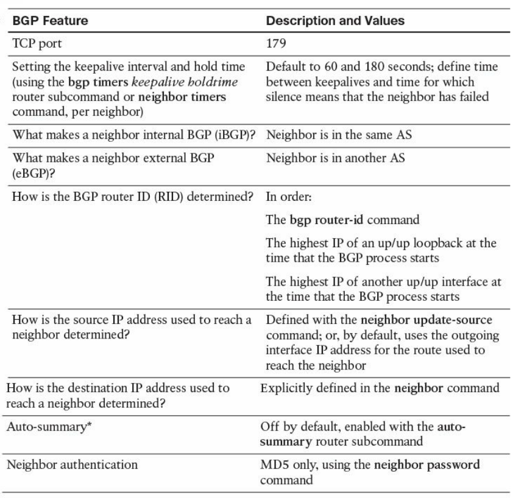

# IGP
## EIGRP

## OSPF
### OSPF Router IDs
1. Hard coded  under process
2. Highest IP of non-shut loopback which is not RID in any other OSPF process
3. Highest IP of non-shut physical iface which is not RID in any other OSPF process

### OSPF Message Types

### OSPF Neighbour States
* Down
  * Initial state
  * Seen when a working adjacency is torn down
  * Or when a manually configured neighbour stops responding to Hellos
* Attempt
  * Valid only for NBMA
  * Neighbours are placed into this state and Hellos are sent normally
  * Placed back into Down if the neigh doesn't respond within the Dead Int
* Init
  * Placed in Init when a valid Hello has been received but the router **can't** see his RID in it
* 2-Way
  * Placed in 2-Way when a valid Hello has been received but the router **can** see his RID in it
* ExStart
  * Purpose - to establish a Master/Slave relationship
  * Empty DBD packets are sent to compare RIDs, determine M/S relation and agree on starting Seq Num
* Exchange
  * M/S relationship established
  * DBD packets are sent populated with LSAs Headers
* Loading
  * Neighbour is kept in this state while the LSAs are downloaded
* Full
  * Full adjacency
  * All missing/outdated LSAs have been downloaded
  
### Hello Process
* Cisco OSPF routers listen for `224.0.0.5` - All OSPF Routers
* Hellos are sourced from the primary IP address of the OSPF enabled iface
* Neigbour checks:
  * Authentication
  * Same subnet/mask
  * Same OSPF area
  * Same area type (regular, stub etc)
  * Must not have duplicate RIDs
  * OSPF timers must match
  * **MTU must be equal forthe DBD packets to be exchanged correctly. It would affect ExStart and 
  Exchange but routers can become neighbours up to and including 2-Way**

### DBD Exchange: Master/Slave Relationship
* Only a Master is allowed to send DBD packets on its own and increase the SeqNum
* Slaves can only reply
* Flags
  * Master (MS) - Set in all Master packers and cleared in all Slave packets
  * More (M) - Set to indicate that more DBD packets are coming
  * Init (I) - Set to indicate it's the first packet in an exchange
* LSA Exchange Process:
  * in ExStart
    * Both routers set all flags and send out an empty DBD packet
    * They compare RIDs and the lower RID changes its role to Slave and clears MS and I
  * they move to Exchange
    * The Master increases the SeqNum and sends out anther DBD (optionally with one or more LSA 
  Headers)
    * The Slave will reply with the same SeqNum (optionally advertising its LSA Headers)
    * The process keeps repeating until all LSAs have been advertised and the M flags are cleared
    * Routers compare received LSA Headers SeqNum with what they know
    * Newer SeqNum are prefered
  * in Loading
    * Link-State Req (LSR) packets are sent to get the info of the missing/outdated LSAs
    * Link-State Update (LSU) are sent with the requested LSA info
    * Link-State Ack (LSAck) are used for the reliable transport of LSA info

### DR/BDR Election
* `224.0.0.6` - All OSPF DR Routers
* All routers in the area for full adjacencies only with DR/BDR
* All other neigbours are stuck in a **2WAY/DROTHER** state
  * Neighbours - Routers sharing the same data link and exchanging Hellos with matching params
  * Adjacent - Neighbours which have completely exchanged DBDs and LSUs 
* DR Election
  * Routers with the OSPF priority 1-255 can participate in election (0 is ignored)
  * They collect all the other RIDs and priorities during the wait interval (set to the Dead Int)
  * When they have all info they choose the highest priority to be DR (if not elected already) and 
  second highest priority for BDR (if not elected already)
  * If all priorities are equal - highest RID becomes DR and second BDR
  * New routers don't preempt when coming online with a better priority
  
### OSPF Design and Areas

* OSPF Path Selection
  * Intra-Area > Inter-Area
  * ABRs ignore type 3 LSAs learned in a nonbackbone area during SPF calculation, which prevents an 
  ABR from choosing a route that goes into a nonbackbone area and then back into the backbone.
##### LSA Types

* LSA Considerations
  * LSA3
    * ABRs use only the LSA3s received over a backbone area in calcluating SPF. The others stored in
    the LSDB and flooded but not used
    * When an ABR creats and floods LSA3s from one area to another, only Intra-Area routes are 
    flooded from nonbackbone to backbone and Inter and Intra-Area from the backbone
  * LSA5
    * E1 - external metric = metric to reach the ASBR + ASBR's advertised metric
    * E2 = fixed metric (cisco default)
    
* OSPF Stubby Area Types

* OSPF Best Path

  
## BGP
### BGP Features

### BGP Messages and Neighbor States
* Open Message
  * After TCP establishes both neigh send Open messages containing:
    * BGP ver no
    * ASN
    * Hold Time - Max no of seconds befor receiving a Keepalive or Update
    * BGP Identifier - BGP RID - same process as OSPF
    * Optional params
* Keepalive Message
  * Sent if a router accepts the Open message params and every 60s (Cisco)
* Update Message
  * Advertises/withdraws routes
    * Network Layer Reachbility Info (NLRI) - one or more tuples (Length, Prefix)
    * Path Attributes
    * Withdrawn Routes
* Notification Messages
  * Sent when an error message is detected and always closes the TCP session

* Idle
  * Initial state
  * No TCP connections accepted or attempted
  * A Start event triggers BGP to initialize all BGP resources
* Connect
  * Sets the ConnectRetry timer
  * Waiting for the TCP session to complete
  * If it completes it sends the Open message and goes to OpenSent and clears the ConnectRetry timer
  * If it fails it goes to Active and resets the ConnectRetry timer
* Active
  * Actively trying to open the TCP session
  * If it succeeds it sends the Open message and goes to OpenSent and clears the ConnectRetry timer
  * If the ConnectRetry timer expires it goes back to Connect
  * If a neigh attempts to try a connection with an unexpected address it stays in Active
  * Any other event sends it to Idle
* OpenSent
  * Open msg sent
  * Open msg awaited - when received it checks the fields
  * Errors trigger a Notification message and sends it to Idle
  * If no errors - a Keepalive msg is sent and the Keepalive timer is set, hold timer is negotiated
  with the smaller values winning
  * Goes to OpenConfirm
* OpenConfirm
  * Waits for Keepalive or Notification
  * Keepalive -> Established
  * Notification -> Idle
  * Hold timer expires -> Idle
* Estgablished
  * Neighbours are up
  * Updates and Keepalives are exchanged (Hold timer is reset to 0 everytime one of them is received)
  * Notification -> Idle
  * Any other event -> Notification -> Idle
  
### BGP Path Attributes
* Well-known mandatory - recognized by all BGP implem - added to all Updates
* Well-known discretionary - recognized by all BGP implem
* Optional transitive - a BGP process should accept the path in which it is included, even if it 
  doesn't support the attribute, and it should pass the path on to its peers
* Optional nontransitive

* Origin
  * IGP - learned from IGP - highest pref
  * EGP
  * Incomplete - cannot determine to origine (redistribution usually) - lowest pref
* AS_PATH
  * Describes all the autonomous systems it has passed through, beginning with the most recent AS 
  and ending with the originating AS - shorter is pref
* NEXT_HOP
  * If the ADV and REC routers are external peers, the Next Hop is the ADV router's iface
  * If they are internal peers and the prefix is in the same ASN the Next Hop is the IP of the neigh
  that advertised it
  * If they are internal peers and the prefix is in a different ASN the Next Hop is the IP of the
  external neigh which advertised the prefix
* LOCAL_PREF
  * Passed only to internal peers
  * Higher pref
* MULTI_EXIT_DISC
  * Affects traffic leaving the AS
  * Allows an AS to inform another AS of its preferred entry points
  * Lowest pref
  * Not passed beyond the receiving AS
  * [Case Study - deterministic med and always compare med](case_studies/bgp-deterministic-and-always-compare-med.md)
* ATOMIC_AGGREGATE and AGGREGATOR
  * When Aggregation happens some path info might be lost
  * ATOMIC_AGGREGATE alerts downstream routers that a loss of path info has occured
  * Receiving routers can't make NLRI information of that route more specific
  * AGGREGATOR attribute informs downstream routers about where the aggregation was performed
  * It includes the ASN and the IP of the router which performed the Aggregation
* COMMUNITY
  * Internet - routes belonging to this Comm are advertised freely
  * NO_EXPORT - Cannot be advertised to another EBGP peers (or outside the Confederation)
  * NO_ADVERTISE - Cannot be advertised to ANY peer
  * LOCAL_AS - Cannot be advertised to another EBGP peer (including EBGP peers within a Confed)
* ORIGINATOR_ID and CLUSTER_LIST
  * Used in a RR setup
  * ORIGINATOR_ID is the IP of the router which originated the prefix - created by the RR
  * CLUSTER_LIST is a seq of RR cluster IDs through which the prefix has passed
* AS_SET
  * Unordered list of the ASNs along the path
  * Useful in case of Aggregation
### BGP PATH SELECTION SEQUENCE

###### 1. Prefer the route with the highest administrative weight. This is a Cisco-specific function, because BGP administrative weight is a Cisco parameter.
###### 2. If the weights are equal, prefer the route with the highest LOCAL_PREF value.
###### 3. If the LOCAL_PREF values are the same, prefer the route that was originated locally on the router. That is, prefer a route that was learned from an IGP on the same router.
###### 4. If the LOCAL_PREF is the same, and no route was locally originated, prefer the route with the shortest AS_PATH.
###### 5. If the AS_PATH length is the same, prefer the path with the lowest origin code. IGP is lower than EGP, which is lower than Incomplete.
###### 6. If the origin codes are the same, prefer the route with the lowest MULTI_EXIT_DISC value. This comparison is done only if the AS number is the same for all the routes being considered.
###### 7. If the MED is the same, prefer EBGP routes over confederation EBGP routes, and prefer confederation EBGP routes over IBGP routes.
###### 8. If the routes are still equal, prefer the route with the shortest path to the BGP NEXT_HOP. This is the route with the lowest IGP metric to the next-hop router.
###### 9. If the routes are still equal, they are from the same neighboring AS, and BGP multipath is enabled with the maximum-paths command, install all the equal-cost routes in the Loc-RIB.
###### 10. If multipath is not enabled, prefer the route with the lowest BGP router ID.

### BGP as-override vs allow-as-in
[Case Study](case_studies/bgp-as-override-vs-allow-as-in.md)

## MPLS

## DMVPN

## IPSEC

## ISIS

