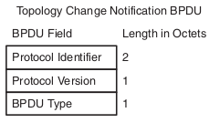
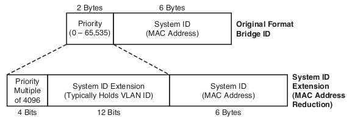
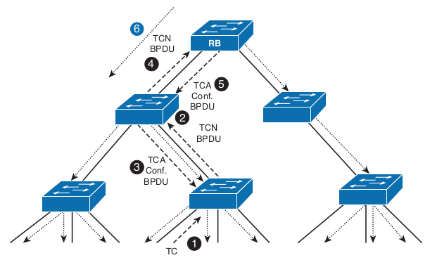
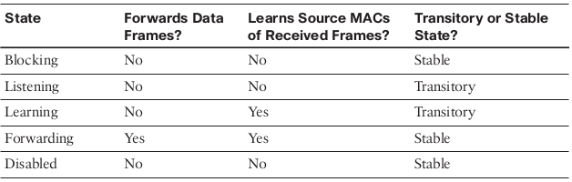
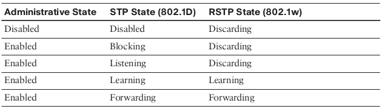
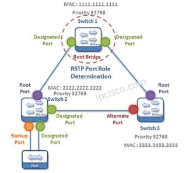

# STP
### STP Protocol Messages
* BPDUs - Bridge Protocol Data Units \
") 
* Any 2 BPDUs are compared in the following sequence - first occurence of a lower values stops the 
process:
    * Root Bridge ID (RBID)
    * Root Path Cost (RPC)
    * Sender Bridge ID (SBID)
    * Sender Port ID (SPID)
    * Receiver Port ID (RPID; not included in the BPDU, evaluated locally)

### How it works
1. Elect root bridge
2. Elect root ports
3. Elect designated ports

#### Root bridge election
* Lowest bridge ID becomes root bridge
* Bridge contains
    * Bridge priority: 0 - 61440 (increments of 4096) - default 32768
    * System ID Extension: 0 - 4095 (for VLANs)
    * MAC Address (in a default switch group the lowest MAC becomes root)

* Changing root election:
    * Manually - changing brigde priority (Lower is better)
    * Use root bridge macro (looks at current root bridge and sets the BID priority to lower than 
    that)
    
#### Root port election - Upstream forwarding
* Root creates and sends Hello BPDUs every 2 secs (default)
    * RBID and SBID set to it's own BID
    * RPC set to 0
    * SPID set to the egress port ID
* Every nonroot switch receives the BPDUs on a port and adds the cost of that ingress port to the 
RPC resulting **a new BPDU**. That ingress port becomes a Root Port.
* The **new BDPU** is forwarded out the Designated Ports (after updating the RPC, SBPID and SPID).
Hellos received on other non-root ports are processed but not forwarded
* Switches don't forward Hellos out Root/Blocking ports

#### Designated port election - downstream forwarding
* A converged STP topology results in only one switch forwarding Hellos onto each LAN segment. 
The switch that forwards Hellos onto a LAN segment is called the **designated switch** for that 
segment.
* The port connecting to the designaged switch is called a **designated port (DP)**
* All non-RP or non-DP ports will be Blocking Ports (BP)
* **RPs and BPs don't send BPDUs - only DPs send BPDUs out to a LAN Segment**

### Topology Changes
A topology change is an event that occurs when:
* A TCN BPDU is received by a DP of a switch
* A port moves to the Forwarding State and the switch has at least one DP
* A port moves from Learning or Forwarding to Blocking
* A switch becomes the root switch \

#### Reaction to a topology change
1. SW2's RP goes down so SW2 now thinks he is the Root bridge and start sending his BPDUs to SW4
2. SW4 sees SW2's BPDUs as inferior to the one he knows (SW1's) and will ignore them until SW1's 
BPDUs expire (MaxAge-MessageAge, or 20−1=19 seconds). During this time no BPDUs are sent to SW3
3. SW3 doesn't receive any BPDUs on Fa0/4 and after MaxAge-MessageAge, or 20−2=18 seconds. After 
that it becomes DP and moves into Listening state. Fa0/1 becomes the new RP and BPDUs will be 
forwarded out of Fa0/4 (with the necessary fields)
4. SW4 learns of a better RBID and moves Fa0/3 to RP and will inform SW2 about it
5. SW2 will do the same

#### Topology Change Notification and Updating the CAM

1. A TC event occurs on a port of a switch
2. The SW sends a TCN BPDU out its RP every Hello timer until Ack
3. The designated SW on that segment Ack that BPDU by sending a Hello with the TC Ack bit set
4. The same SW sends the TCN BPDU upstream and the process repeats
5. The Root bridge receives the TCN BPDU and sends a TC Ack
6. For the MaxAge+ForwardDelay seconds the Root will send BPDUs with the TC bit set telling SWs to
shorten their aging time for their MAC address tables to ForwardDelay secs

#### Port states

## RSTP
#### Port states

* A Discarding port continues to process received BPDUs; send BPDUs (depending on its role); 
and send and receive frames of inter-switch signaling protocols such as DTP, VTP, CDP, LLDP, 
PAgP, LACP, or LOOP.

#### Port roles
* Root Port - no changes
* Designated Port - no changes
* Alternate Port 
    * A backup for an RP
    * They receive BPDUs but don't meet the requirements to be a RP/DP
    * When the RP goes down the AP receiving the best BPDU is RAPIDLY moved to that role
* Backup Port 
    * A backup for a DP
    * They receive BPDUs but don't meet the requirements to be a DP
    * When the DP fails the BP takeover is NOT RAPID (timer driven)

#### Port types
* Edge or Non-Edge
* An Edge Port 
    * Becomes DP immediately
    * Sends BPDUs but doesn't expect to receive any
    * If it receives a BPDU it moves to a Non-Edge type port
    * The config doesn't change and it will go back to Edge when bounced

#### Changes to BPDU Format and Handling
In RSTP there's only one type of BPDU used. The TCN BPDU is no longer used.

* In STP only the Root sends Config BPDUs. Non-root SWs relay Root BPDUs. Reaction is delayed in
case of a failure - if a non-root SW stops receiving BPDUs it has to wait MaxAge-MessageAge seconds 
for the BPDU stored on the Root Port to expire
* in RSTP every SW sends its own BPDUs (based on the Root BPDUs) allowing SWs to age-out BPDUs faster
3 x Hello interval). The MessageAge field no longer matters in BPDU expiry. Only as a hop count metric.
Any BPDU whose MessageAge is equal to or higher than its MaxAge will be discarded upon arrival.