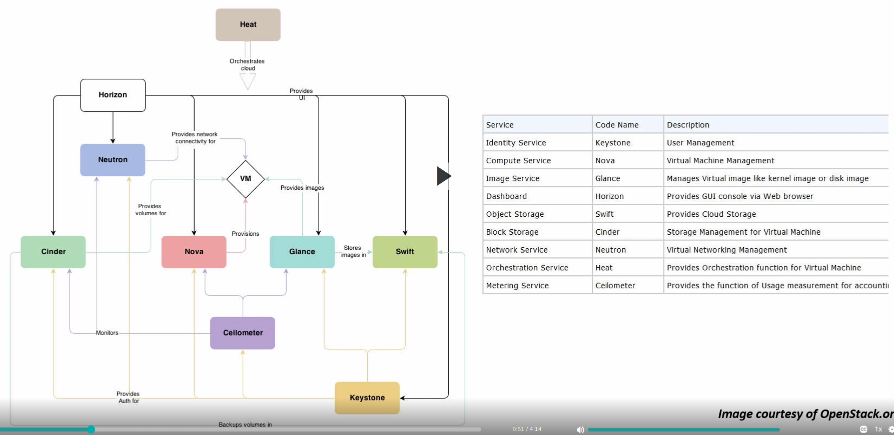
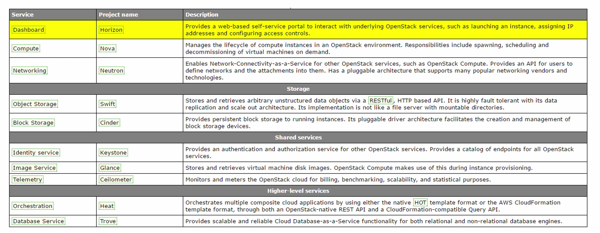

### Key Terms and Concepts

* Tenant 
  - A container used to group or isolate resources. Tenants also group or isolate identity 
objects. Depending on the service operator, a tenant may map to a customer, account, organization 
or project.

* Service 
  - An OS service such as Compute (nova), Object Storage (swift) or Image Service (glance). 
It provides one or more endpoints in which users can access resources and perform operations. After
installing keystone - we execute keystone commands to register these services with keystone.

* Endpoint
  - A network-accessible address where you access a service (URL)
  
* Role
  - A personality with defined user rights and privileges

### OpenStack Architecture
 

