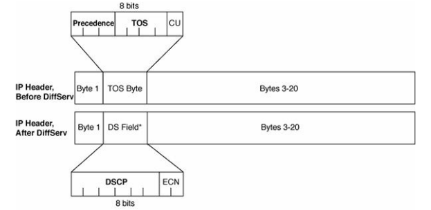
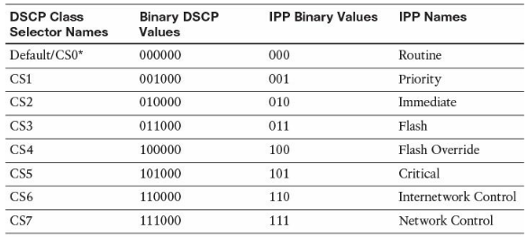
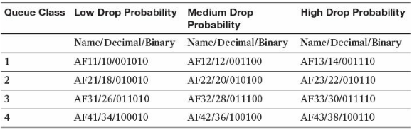
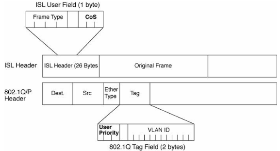
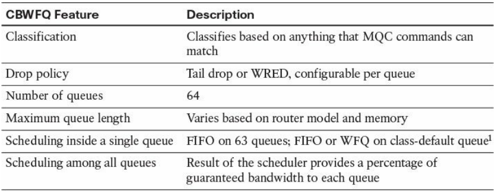

# QoS
### Classification & Marking

* IP ToS Byte and DS Field Compared

* Default and Class Selector DSCP Values

* Assured Forwarding DSCP Values—Names, Binary Values, and Decimal Values

* LAN CoS Fields

### Congestion Management & Avoidance
* Queuing
  * Software queues - LLQ, CBWFQ etc
  * Hardware queues
    * packets from SW queue are moved to HW queue
    * transimited FIFO
    * called transmit queue/ring (Tx queue/ring)

##### Queuing Tools: CBWFQ and LLQ
* CBWFQ Basic Features and Configuration
  * CBWFQ Functions and Features

* Low-Latency Queuing

