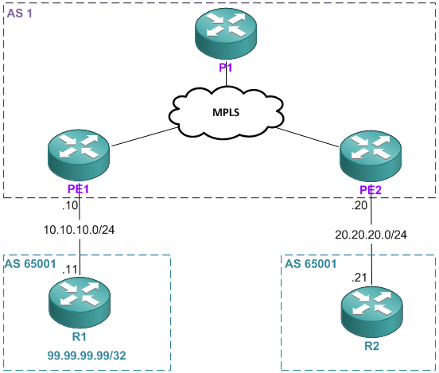

These two functions are pretty similar, just with subtle differences. They can be used in an 
environment where a customer is using one AS number for many sites that are connected to an ISP. 
This is shown in the example below.

\
You can see that AS `65001` connects to the ISP at two locations. So when R2 receives the prefix 
`99.99.99.99/32`, he will see that the AS path is via 1, `65001`. Because of the loop prevention 
mechanism, R2 will have to reject this prefix because it can see its own AS in the `AS_PATH` 
attribute. I’ll demonstrate that now. But first, I’m going to post the full configurations because 
this can be pretty confusing to configure.
```
PE1#
ip vrf google
 rd 100:1
 route-target export 100:1
 route-target import 100:1
!
interface Loopback0
 ip address 1.1.1.1 255.255.255.255
!
interface FastEthernet0/0
 ip vrf forwarding google
 ip address 10.10.10.10 255.255.255.0
!
interface FastEthernet0/1
 ip address 15.15.15.1 255.255.255.0
 mpls ip
!
router ospf 1
 network 1.1.1.1 0.0.0.0 area 0
 network 15.15.15.0 0.0.0.255 area 0
!
router bgp 1
 no synchronization
 bgp log-neighbor-changes
 neighbor 2.2.2.2 remote-as 1
 neighbor 2.2.2.2 update-source Loopback0
 neighbor 2.2.2.2 next-hop-self
 no auto-summary
 !
 address-family vpnv4
  neighbor 2.2.2.2 activate
  neighbor 2.2.2.2 send-community extended
 exit-address-family
 !
 address-family ipv4 vrf google
  neighbor 10.10.10.11 remote-as 65001
  neighbor 10.10.10.11 activate
  no synchronization
 exit-address-family
```
```
PE2#
ip vrf google
 rd 100:1
 route-target export 100:1
 route-target import 100:1
!
interface Loopback0
 ip address 2.2.2.2 255.255.255.255
!
interface FastEthernet0/0
 ip vrf forwarding google
 ip address 20.20.20.20 255.255.255.0
!
interface FastEthernet0/1
 ip address 25.25.25.2 255.255.255.0
 mpls ip
!
router ospf 1
 network 2.2.2.2 0.0.0.0 area 0
 network 25.25.25.0 0.0.0.255 area 0
!
router bgp 1
 no synchronization
 bgp log-neighbor-changes
 neighbor 1.1.1.1 remote-as 1
 neighbor 1.1.1.1 update-source Loopback0
 neighbor 1.1.1.1 next-hop-self
 no auto-summary
 !
 address-family vpnv4
  neighbor 1.1.1.1 activate
  neighbor 1.1.1.1 send-community extended
 exit-address-family
 !
 address-family ipv4 vrf google
  neighbor 20.20.20.21 remote-as 65001
  neighbor 20.20.20.21 activate
  no synchronization
 exit-address-family
```
```
R1#
interface Loopback0
 ip address 99.99.99.99 255.255.255.255
!
interface FastEthernet0/0
 ip address 10.10.10.11 255.255.255.0
!
router bgp 65001
 no synchronization
 bgp log-neighbor-changes
 network 10.10.10.0 mask 255.255.255.0
 network 99.99.99.99 mask 255.255.255.255
 neighbor 10.10.10.10 remote-as 1
 no auto-summary
```
```
R2#
interface FastEthernet0/0
 ip address 20.20.20.21 255.255.255.0
!
router bgp 65001
 no synchronization
 bgp log-neighbor-changes
 network 20.20.20.0 mask 255.255.255.0
 neighbor 20.20.20.20 remote-as 1
 no auto-summary
```
```
P1#
interface FastEthernet0/0
 ip address 15.15.15.2 255.255.255.0
 mpls ip
!
interface FastEthernet0/1
 ip address 25.25.25.1 255.255.255.0
 mpls ip
!
router ospf 1
 network 15.15.15.0 0.0.0.255 area 0
 network 25.25.25.0 0.0.0.255 area 0
 network 35.35.35.0 0.0.0.255 area 0
```
So currently, on R2, he is not accepting any prefixes from R1 in the other site; as shown below 
(we would expect the `10.10.10.0/24` and `99.99.99.99/32` networks to be in the BGP table).
```
R2#sh ip bgp | b Network
   Network          Next Hop            Metric LocPrf Weight Path
*> 20.20.20.0/24    0.0.0.0                  0         32768 i
```
The debug below shows why he’s not accepting these prefixes.
```
*Mar  1 02:28:03.515: %BGP-5-ADJCHANGE: neighbor 20.20.20.20 Up
*Mar  1 02:28:03.559: BGP(0): 20.20.20.20 rcv UPDATE w/ attr: nexthop 20.20.20.20, origin i, originator 0.0.0.0, path 1 65001, community , extended community
*Mar  1 02:28:03.559: BGP(0): 20.20.20.20 rcv UPDATE about 10.10.10.0/24 -- DENIED due to: AS-PATH contains our own AS;
*Mar  1 02:28:03.559: BGP(0): 20.20.20.20 rcv UPDATE about 99.99.99.99/32 -- DENIED due to: AS-PATH contains our own AS;
```
One way to fix this is to use the allow-as-in command. This allows R2 to override the loop 
prevention mechanism by allowing an instance of AS `65001` to be in the AS_PATH. Let’s do that now
```
R2(config-router)#neighbor 20.20.20.20 allowas-in 1
R2(config-router)#
*Mar  1 02:34:34.927: BGP: 20.20.20.20 sending REFRESH_REQ(5) for afi/safi: 1/1
*Mar  1 02:34:34.927: BGP: 20.20.20.20 send message type 5, length (incl. header) 23
*Mar  1 02:34:35.015: BGP(0): 20.20.20.20 rcvd UPDATE w/ attr: nexthop 20.20.20.20, origin i, path 1 65001
*Mar  1 02:34:35.015: BGP(0): 20.20.20.20 rcvd 10.10.10.0/24
*Mar  1 02:34:35.015: BGP(0): 20.20.20.20 rcvd 99.99.99.99/32
*Mar  1 02:34:35.019: BGP(0): Revise route installing 1 of 1 routes for 10.10.10.0/24 -> 20.20.20.20(main) to main IP table
*Mar  1 02:34:35.019: BGP(0): Revise route installing 1 of 1 routes for 99.99.99.99/32 -> 20.20.20.20(main) to main IP table
R2(config-router)#do sh ip bgp
BGP table version is 4, local router ID is 20.20.20.21
Status codes: s suppressed, d damped, h history, * valid, > best, i - internal,
              r RIB-failure, S Stale
Origin codes: i - IGP, e - EGP, ? - incomplete

   Network          Next Hop            Metric LocPrf Weight Path
*> 10.10.10.0/24    20.20.20.20                            0 1 65001 i
*> 20.20.20.0/24    0.0.0.0                  0         32768 i
*> 99.99.99.99/32   20.20.20.20                            0 1 65001 i
```
So you can see (on R2) that the AS_PATH is `1, 65001` for these prefixes. It keeps all the AS_PATH 
information and simply just allows 1 occurance of `65001` to be in the AS_PATH; thus overriding the 
loop prevention mechanism. We would obviously need to do this on R1 in order for R1 to have 
reachability to the `20.20.20.0/24` prefix (sitting between PE2 and R2) so that he can have a route 
back to R2.
```
R1(config)#router bgp 65001
R1(config-router)#neighbor 10.10.10.10 allowas-in 1
```
```
R2#ping 99.99.99.99

Type escape sequence to abort.
Sending 5, 100-byte ICMP Echos to 99.99.99.99, timeout is 2 seconds:
!!!!!
Success rate is 100 percent (5/5), round-trip min/avg/max = 68/83/116 ms
```
The other way you can complete this task is by getting PE1 & PE2 to just strip AS `65001` from the 
BGP UPDATE before sending it to the customer edge routers. Let’s do that now.
```
R1(config-router)#no neighbor 10.10.10.10 allowas-in 1
R2(config-router)#no neighbor 20.20.20.20 allowas-in 1

pe2(config)#router bgp 1
pe2(config-router)#address-family ipv4 unicast vrf google
pe2(config-router-af)#neighbor 20.20.20.21 as-override

pe1(config)#router bgp 1
pe1(config-router)#address-family ipv4 unicast vrf google
pe1(config-router-af)#neighbor 10.10.10.11 as-override
```
By configuring this command it actually resets the peer, so there’s no need to clear any neighbors. 
The result of this is shown on R2 below.
```
R2#sh ip bgp | b Network

   Network          Next Hop            Metric LocPrf Weight Path
*> 10.10.10.0/24    20.20.20.20                            0 1 1 i
*> 20.20.20.0/24    0.0.0.0                  0         32768 i
*> 99.99.99.99/32   20.20.20.20                            0 1 1 i
```
So the AS_PATH has been overridden by the PE routers to their AS number instead. This is the key 
difference between the two commands. Allow-as-in allowed the loop prevention to be ignored for 
the configured amount of instances, and the as-override caused the PE routers to modify the 
AS_PATH.
